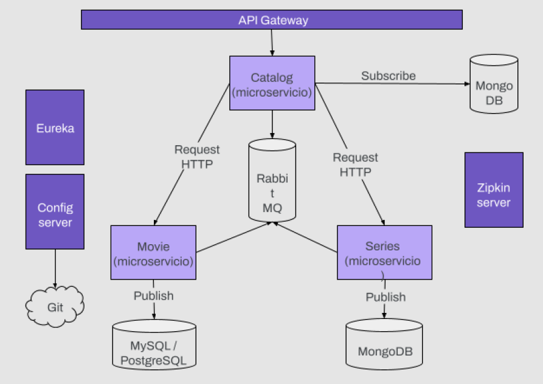

# Proyecto Final | Especialización en Backend I - Certified Tech Developer

## Descripción

Este proyecto consiste en una arquitectura de **microservicios** implementada utilizando diversas tecnologías y patrones como _Eureka, Gateway, Config Server, RabbitMQ, Feign, Circuit Braker, Load Balancer y Zipkin_. Además, se usa Docker para gestionar contenedores de MySQL y MongoDB, facilitando así la configuración del entorno de desarrollo y despliegue del sistema.

## Tecnologías Utilizadas

- **Eureka:** Servicio de registro y descubrimiento de microservicios.
- **Gateway:** Enrutamiento y balanceo de carga.
- **Config Server:** Servidor de configuración centralizada.
- **RabbitMQ:** Cola de mensajes para la comunicación entre microservicios.
- **Feign:** Cliente HTTP declarativo para simplificar la integración entre microservicios.
- **Zipkin:** Herramienta de trazabilidad para el seguimiento y monitoreo de las solicitudes.
- **Circuit Breaker:** Patrón de diseño que mejora la resiliencia de los sistemas al detectar y manejar fallos en la comunicación entre servicios.
- **Load Balancer:** Herramienta para distribuir la carga de trabajo entre múltiples instancias de un servicio para mejorar el rendimiento y la disponibilidad.
- **Docker:** Plataforma de contenedores para la gestión de MySQL y MongoDB.

## Ventajas de una Arquitectura de Microservicios

Algunas ventajas de utilizar una arquitectura de microservicios son:

- **Escalabilidad:** Permite escalar cada servicio de manera independiente, lo que facilita la gestión de la carga y optimiza el uso de recursos.

- **Despliegue Independiente:** Cada microservicio puede ser desarrollado, probado y desplegado de forma independiente, lo que agiliza el ciclo de desarrollo y mejora la flexibilidad del sistema.

- **Resiliencia:** Los microservicios están diseñados para ser tolerantes a fallos. Un fallo en un microservicio no afecta necesariamente a otros servicios, lo que reduce la probabilidad de fallos catastróficos en todo el sistema.

- **Facilidad de Mantenimiento:** La modularidad de los microservicios facilita la comprensión del sistema y permite realizar cambios y actualizaciones de manera más segura y rápida.

- **Tecnología Apropiada:** Cada microservicio puede ser desarrollado utilizando la tecnología más adecuada para su función específica, lo que permite utilizar diferentes lenguajes de programación, bases de datos, etc., según sea necesario.

- **Mejora en la Colaboración:** Favorece la colaboración entre equipos de desarrollo al dividir el sistema en componentes más pequeños y manejables.

- **Mejora en el Tiempo de Lanzamiento al Mercado:** La capacidad de desarrollar, probar y desplegar servicios de forma independiente permite acelerar el tiempo de lanzamiento al mercado de nuevas funcionalidades.

- **Mayor Adaptabilidad:** Permite una mayor adaptabilidad a medida que los requisitos del negocio cambian con el tiempo, ya que cada microservicio puede evolucionar de forma independiente.

Estas son solo algunas de las ventajas clave de utilizar una arquitectura de microservicios en el desarrollo de aplicaciones.

## Requisitos

- JDK (Java Development Kit)
- Maven
- Docker

## Configuración

1. Clona este repositorio: `git clone https://github.com/mmascheroni/especializacion-backend-I`
2. Abre el proyecto en tu IDE preferido como IntelliJ por ejemplo.
3. Inicia los servicios de Eureka, Gateway y Config Server.
4. Ejecuta los contenedores de MySQL y RabbitMQ + Zipkin utilizando Docker.
5. Inicia cada microservicio.

## Puertos
A continuación se detallan los puertos en los que se ejecutarán los servicios:

- Eureka: 8761.
- Gateway: 8080.
- Zipkin: 9411.
- RabbitMQ: 5672.

Los microservicios están configurados para iniciar en puertos aleatorios por las distintas instancias que puedan existir.
El archivo de configuraciones se encuentra en el siguiente enlace:
[Repositorio de Configuraciones](https://github.com/mmascheroni/CentralizedConfigurations)
